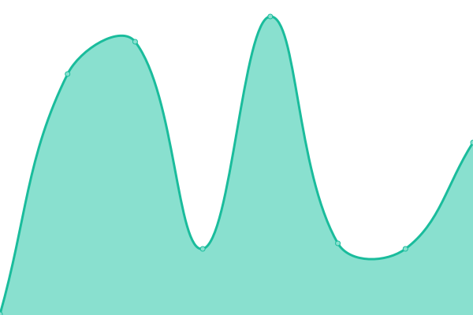
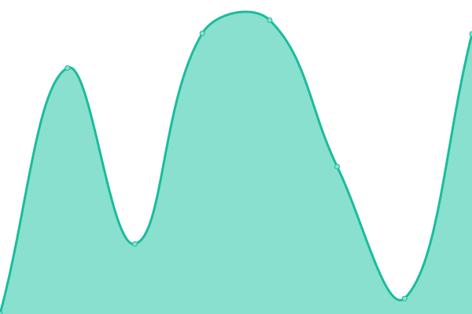

# [📈 Live Status](https://demo.upptime.js.org): <!--live status--> **🟧 Partial outage**

This repository contains the open-source uptime monitor and status page for [Upptime](https://upptime.js.org), powered by [Upptime](https://github.com/upptime/upptime).

With [Upptime](https://upptime.js.org), you can get your own unlimited and free uptime monitor and status page, powered entirely by a GitHub repository. We use [Issues](https://github.com/upptime/upptime/issues) as incident reports, [Actions](https://github.com/deeper-chain/deeper-upptime/actions) as uptime monitors, and [Pages](https://demo.upptime.js.org) for the status page.

<!--start: status pages-->
<!-- This summary is generated by Upptime (https://github.com/upptime/upptime) -->
<!-- Do not edit this manually, your changes will be overwritten -->
<!-- prettier-ignore -->
| URL | Status | History | Response Time | Uptime |
| --- | ------ | ------- | ------------- | ------ |
|  [Deeper Testnet](https://mainnet-dev.deeper.network/health) | 🟩 Up | [deeper-testnet.yml](https://github.com/deeper-chain/deeper-dev-upptime/commits/HEAD/history/deeper-testnet.yml) | 

 173ms
     
 | 

<a href="https://status-dev.deeper.network/history/deeper-testnet">0.00%</a>
    

|  [DeeperScan Dev](https://dev.deeperscan.io/deeper) | 🟩 Up | [deeper-scan-dev.yml](https://github.com/deeper-chain/deeper-dev-upptime/commits/HEAD/history/deeper-scan-dev.yml) | 

 194ms
     
 | 

<a href="https://status-dev.deeper.network/history/deeper-scan-dev">99.91%</a>
    

|  [EVM dev](https://blockscout-dev.deeper.network/) | 🟥 Down | [evm-dev.yml](https://github.com/deeper-chain/deeper-dev-upptime/commits/HEAD/history/evm-dev.yml) | 

 3063ms
     
 | 

<a href="https://status-dev.deeper.network/history/evm-dev">0.00%</a>
    

|  [Deeper Chain Explorer Dev](https://apps-dev.deeper.network) | 🟩 Up | [deeper-chain-explorer-dev.yml](https://github.com/deeper-chain/deeper-dev-upptime/commits/HEAD/history/deeper-chain-explorer-dev.yml) | 

 875ms
     
 | 

<a href="https://status-dev.deeper.network/history/deeper-chain-explorer-dev">99.91%</a>
    

|  [Sidecar dev](https://sidecar-dev.deeper.network/pallets/Staking/storage/RemainderMiningReward) | 🟩 Up | [sidecar-dev.yml](https://github.com/deeper-chain/deeper-dev-upptime/commits/HEAD/history/sidecar-dev.yml) | 

 2223ms
     
 | 

<a href="https://status-dev.deeper.network/history/sidecar-dev">44.30%</a>
    

<!--end: status pages-->

[**Visit our status website →**](https://demo.upptime.js.org)

## 📄 License

- Powered by: [Upptime](https://github.com/upptime/upptime)
- Code: [MIT](./LICENSE) © [Upptime](https://upptime.js.org)
- Data in the `./history` directory: [Open Database License](https://opendatacommons.org/licenses/odbl/1-0/)
